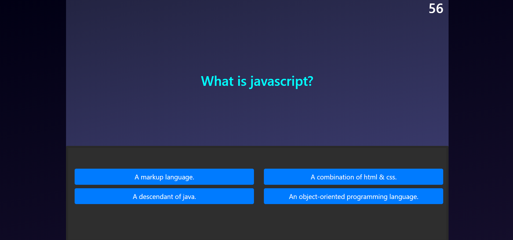

# Code Quiz

## Description
This is a fun quiz designed to test your proficency with javascript concepts. It is a timed quiz where every incorrect answer will lose you 10 seconds of time.

## Screenshot

## Usage
1. Navigate to https://trojanface.github.io/codequiz/
2. Follow the on-screen prompt to begin the quiz.
3. Test your javascript knowledge.
4. Record your name and compare your score to others.

## License
MIT

## Contributors
Matthew Teague
